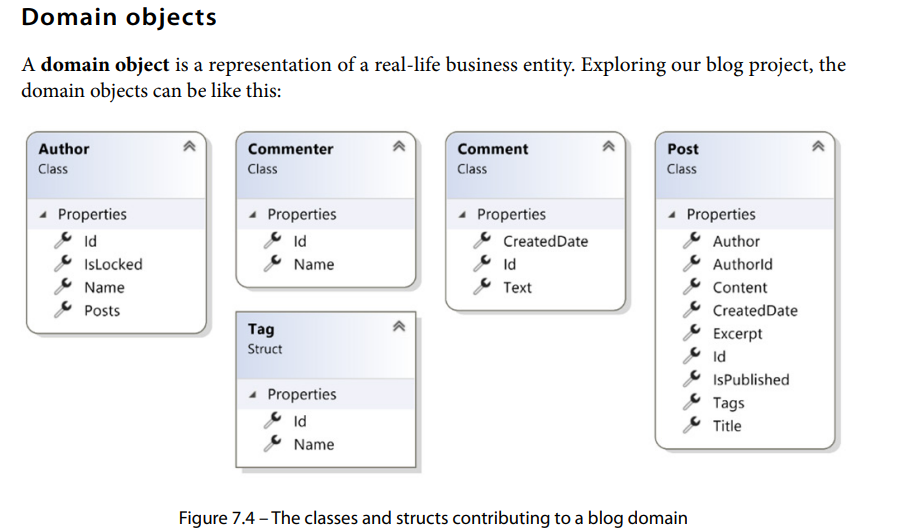
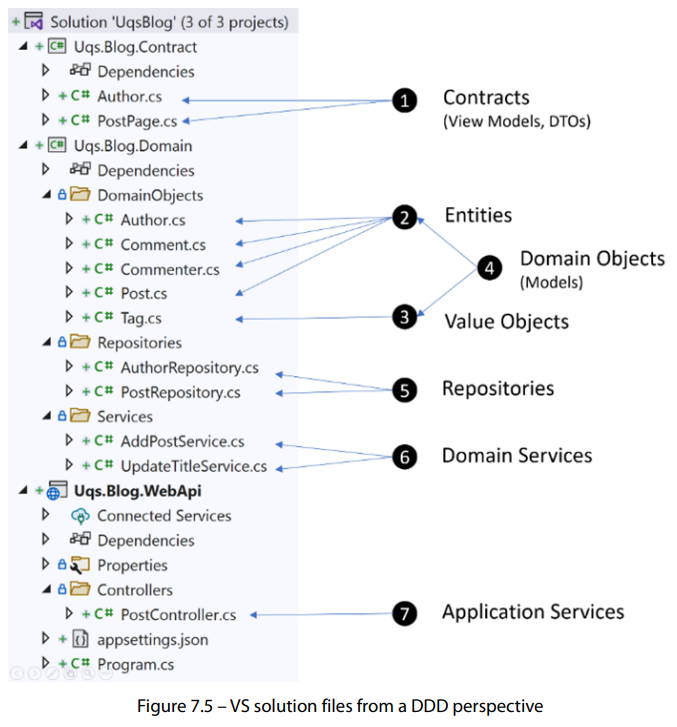

### Commands

Create new solution: `dotnet new sln`
Create new project: `dotnet new webapi -o Uqs.Weather`
Add project to solution: `dotnet sln add Uqs.Weather`

### Service Lifetime

If your concern is performance, then think of a singleton. Then, the next step is checking whether
the service is thread-safe, either by reading its documentation or doing other types of investigation.

Then, fall down to scoped if relevant, and then fall down to transient. The safest option is always
transient—if in doubt, then choose transient!

### Dependency Inject

Watch out for randoms. They are hard to test due to unpredictability. Should move it in DI.

### Terms

#### SUT

System under test.
Code executed un the MethodName in the test is called SUT or code under test (CUT).

### Test Doubles

#### Dummies

Use this as much as possible over others.

#### Stubs

are classes that respond with canned, pre-coded behavior.
Easy to write & read but hard to maintain than mocks.

#### Spies

are extra functionality added to a stub class to reveal what happened inside the stub. Follows the interface whereas mocks dont.

#### Mocks

Similar to stubs but use a trick to generate a behavir w/o implmenting the complete class. It reduces the amount of code to create test double.

#### Fakes

is a test double that replaces a component during unit testing with an equivalent component more suitable for testing purposes.
libraries that mimic part or all of a real-life equivalent, and they exist in order to facilitate testing. E.g. EF Core in-memory database, it is designed for testing only..

---

For any object that should not be part of the SUT or for an unused dependency, use a dummy.
To build and test dependencies, use mocks. Add fakes where it makes sense.

### Sintegration Test

See page 141.

| Unit Test                     | Sintegration Test                          | Integration Test            |
| ----------------------------- | ------------------------------------------ | --------------------------- |
| All test doubles dependencies | Few test doubles and few real dependencies | No test double dependencies |

---

A unit test method should test a single behavior and never test internals

## DDD

### Domains (aka business domain)

e.g. accounting, billing, banking, e-commerce, & etc.

### Domain Objects



DDD doesn't state that domain objects should be mapped to a relational DB table but in
practice, this is what happens as it is more practical to do it in this way, especialy in ORMs.

models, business objects, and domain objects are used interchangeably to mean the same thing.

Two types of domain objects:

- entities
- value objects

#### Value Objects

represent typed values that have no conceptual identity.
Example is Money ($5 bill doesn't have an identity). If it did have serial number it wouldn't be a value object.
Other example is a Date, First Name, Addresses, etc.

Struct is the most appropriate format to model value object but .NET developers rarely use structures unless they are building something low-level, such as performance optimization, and interacting with unmanaged resources. Usually, value objects are modeled with classes or Record, which is not very DDD-compliant.

#### Entities

A domain model that needs to be tracked over time and whose attributes are likely to change over time. Example: person which has changeable email, & home address but has a fixed identity. Examples: Post, Author, Comment, & Commenter.

They are represented as Classes and Records, and definitely have an identifier (ID).

|              | Entity                    | Value Object                             |
| ------------ | ------------------------- | ---------------------------------------- |
| Lifespan     | Live in continuum         | is created and destroyed with ease       |
| Immutability | Mutable                   | Immutable (cannot change after creation) |
| Identifier   | Required to have identity | Don't have                               |

### Agggregates

a group of classes that form one business aim.
Example: managing blog post (Author, Comment, Commenter, Post, Tag)

### Aggregate Root

A single main entity of an aggregate.
accessing (invoking a method) any domain object in an aggregate is conducted through the aggregate root.
Example: in the blog example, Post domain object is the aggregate root.

### Anemic models

an object that contains litttle or no behavior and focuses on carrying data.

```csharp
public class Person
{
    public string Email { get; set; }
    // other properties
}
```

it's an anti-pattern of using anemic models in domain objects is very common between developers, as the practice of setting ORMs such as Entity Framework (EF) and other practicalities does clash with DDD best practices.
But it's more pragmatic and works well with ORMs.

### Ubiquitous language

using well-known terminology in naming your domain objects similar to what the business people are using. Do not invent your own terminology.
This makes is smoother conversation between the business stakeholders and developers.
New devleopers get on with business logic.

### Services

Characteristic of a service:

- Stateless - should not hold a state. No persisting of data in fields or properties of a service class. State are for repositories.
- Ubiquitous language - name services and methods according to business operations.
- Domain Objects
  - DDD is against anemic models.

#### Domain Services

This is where the business logic lives.

Domain service responsibility:

- Loading domain objects through the help of repositories.
- Applying business logic
- Persisting the domain objects with the help of repositories.

It is important to understand that the domain services are unaware of how the data is loaded from the storage medium and how it is stored.

```csharp
public class AddPostService
{
    private readonly IPostRepository _postRepository;
    private readonly IAuthorRepository _authorRepository;
    public AddPostService(IPostRepository postRepository,
         IAuthorRepository authorRepository)
    {
        _postRepository = postRepository;
        _authorRepository = authorRepository;
    }

    public int AddPost(int authorId)
    {
        var author = _authorRepository.GetById(authorId);
        if (author is null)
        {
            throw new ArgumentException(
              "Author Id not found",nameof(authorId));
        }
        if (author.IsLocked)
        {
            throw new InvalidOperationException(
              "Author is locked");
        }
        var newPostId = _postRepository.CreatePost
          (authorId);
        return newPostId;
    }
}
```

#### Infrastucture Services

This abstract technical concerns (cloud storage, service bus, email provider, etc).
SQL Server, CosmosDB, MongoDB, etc.

##### Repositories

It understand the underlying sotrage platform and interact with the specifics of the data store system.
It should not contain business logic. Should only be concerned with loading and saving data.

```csharp
using Dapper;
using System.Data.SqlClient;
…
public interface IPostRepository
{
    int CreatePost(int authorId);
    Post? GetById(int postId);
    void Update(Post post);
}

public class PostRepository : IPostRepository
{
    private readonly IDbConnection _dbConnection;

    public PostRepository(IDbConnection dbConnection)
    {
        _dbConnection = dbConnection;
    }

    public Post? GetById(int postId)
    {
        _dbConnection.Open();
        var post = _dbConnection.Query<Post>(
            "SELECT * FROM Post WHERE Id = @Id", new {Id =
                 postId}).SingleOrDefault();
        _dbConnection.Close();
        return post;
    }
    …
}
```

#### Application Services

This provides the interaction with the outside world or the glue that allows a client to request something from your system.

Example: ASP.NET controller where it can use domain services to provide a response to RESTful request.

This typically use domain services and repositories to deal with external requests.

---

https://github.com/PacktPublishing/Pragmatic-Test-Driven-Development-in-C-Sharp-and-.NET/tree/main/ch07



Let's have a recap of every item:

1. **Contracts**: This is what the outside world sees. These contracts represent the shape of the data that will be exchanged between the backend and the client. The client should know the data elements of the contract, so it knows what to expect from your headless blog.
2. **Entities**: They are the domain objects with identities.
3. **Value Objects**: They are the domain objects that don’t require an identity.
4. **Domain Objects**: This is the group of entities and value objects in your system.
5. **Repositories**: These are the classes that will save and load your data from a data store (relational DB, document DB, file system, blog storage, and so on).
6. **Domain Services**: This is where the business logic will live, and it will interact with the repositories for CRUD operations. These services are not exposed to the outside world.
7. **Application Services**: Controllers in basic scenarios act as application services where they interact with domain services to serve a REST request. Application services are exposed to the outside world.

Let's discuss this DDD-style system:
• **Application Services**: They interact with the clients and the domain services. They deliver the data to a client based on the contract and they deal with domain services directly.
• **Domain Services**: They provide services to Application Services.
• **Infrastructure Services**: They provide services that are not part of the domain, such as fetching the ZIP code/postcode city.
• **Aggregate**: Each aggregate contains several domain objects and has one aggregate root.
• **Domain Objects**: They are all the entities and value objects in all aggregates.
